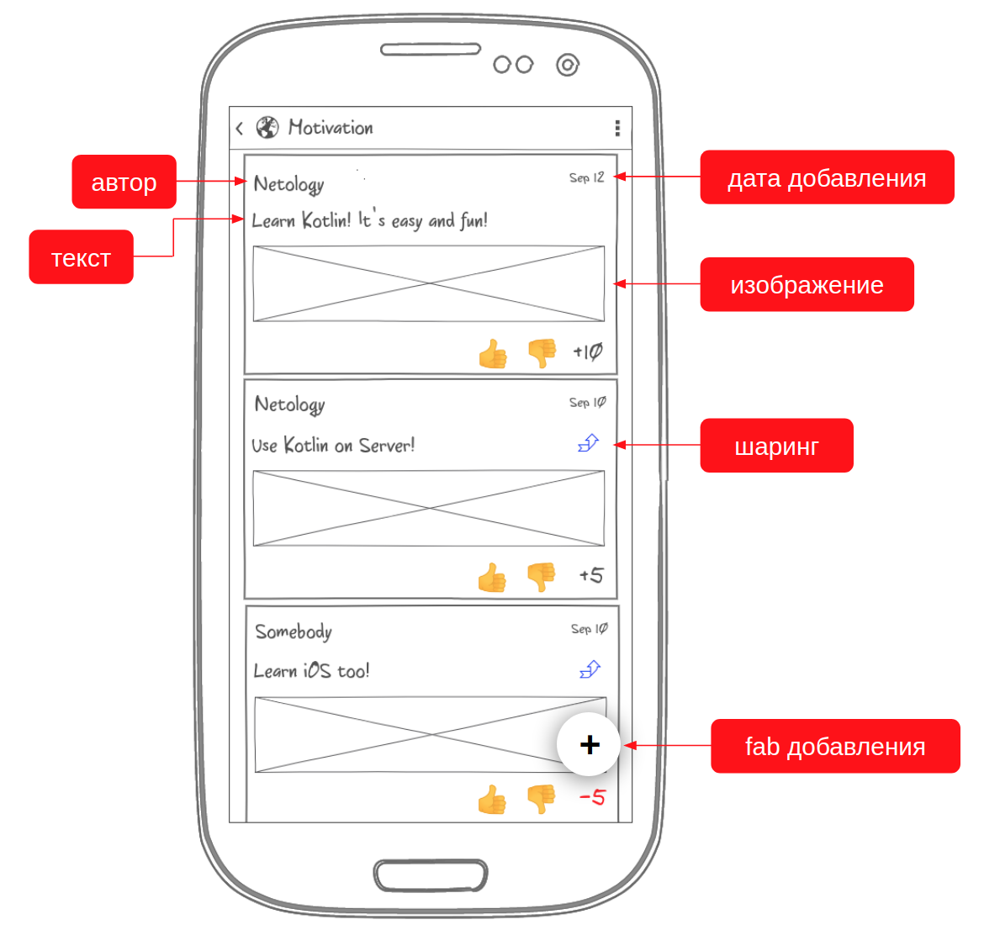

# Дипломная работа по профессии Android-разработчик «Приложение для заметок».
---

## Легенда

Вам предстоит разработать приложение, позволяющее сохранять и просматривать советы, идеи, высказывания и заявления других людей, а, возможно, ваши собственные на вашем смартфоне. А также выставлять им рейтинг (повышать или понижать).

## Прототипы

В качестве прототипов для реализации мы предлагаем вам следующие (это всего лишь эскизы - не нужно пытаться реализовывать подобный дизайн, пользуйтесь стандартными виджетами).

### Экран идей (картинка кликабельна)

Все идеи отсортированы по рейтингу.

У каждой идеи есть:
1. Автор (обязательно)
1. Дата публикации (высчитывается автоматически)
1. Текст (обязательно, максимальное количество символов - не более 100)
1. Изображение (опционально)
1. Ссылка (опционально) - тогда при клике на карточку открывается ссылка в соответствующем приложении

Экран идей должен пролистываться вниз (с подгрузкой более старых идей - по 20 шт.).

Кликабельные элементы:
1. Автор - при клике на автора происходит переход на страницу с точно таким же списком, но только с идеями этого автора (фильтрацию осуществляйте только по имени)
2. Кнопка одобрить (палец вверх)* - при клике добавляется одобрение пользователя для соответствующей идеи (рейтинг увеличивается на 1). Кликать можно сколько угодно несколько раз.
2. Кнопка не одобрить (палец вниз)* - при клике добавляется одобрение пользователя для соответствующей идеи (рейтинг уменьшается на 1). Кликать можно сколько угодно несколько раз.

**Важно**: после одобрения/не одобрения любой идеи карточки автоматически сортируются: те, у кого рейтинг выше, становятся наверх, у кого ниже - вниз.

### Хранение данных

Все данные должны храниться локальной базе данных.

## Архитектура

Поскольку вы - автор системы и ключевой её архитектор, вам предстоит самостоятельно решить, как организовать структуру кода.

Ключевой совет: * захардкодьте часть демо-данных (файлы и данные в памяти), чтобы было удобно проверять и не приходилось каждый раз загружать файлы и создавать записи.

## Требования к оформлению

### Визуальное оформление

Мы никак не ограничиваем вас с точки зрения визуального оформления, но помните, что хорошо бы, чтобы человек, уже знакомый с Android, мог без труда пользоваться вашим приложением.

### Техническое оформление

Всё должно быть оформлено в виде публичного репозитория на GitHub, с CI и автоматическим формированием сборки.
